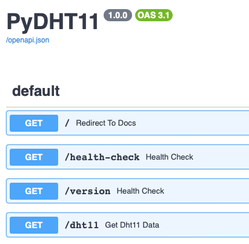

# PyDHT11 API


## Environment

- Python 3.11.+ (3.9.+ or 3.10.+ should work too)
- Raspberry Pi 3B+ (or any other Raspberry Pi with GPIO pins)
- DHT11 sensor

## Setup steps (Raspberry Pi)


```bash
python3 -m venv venv
```

```bash
source venv/bin/activate
```

```bash
pip install -r requirements.txt
```

## Run

```bash
uvicorn app.main:app --host 0.0.0.0 --port 8000 --reload
```

## Access

> Change localhost to your Raspberry Pi IP address to access from another device

- [http://localhost:8000/docs](http://localhost:8000/docs)


